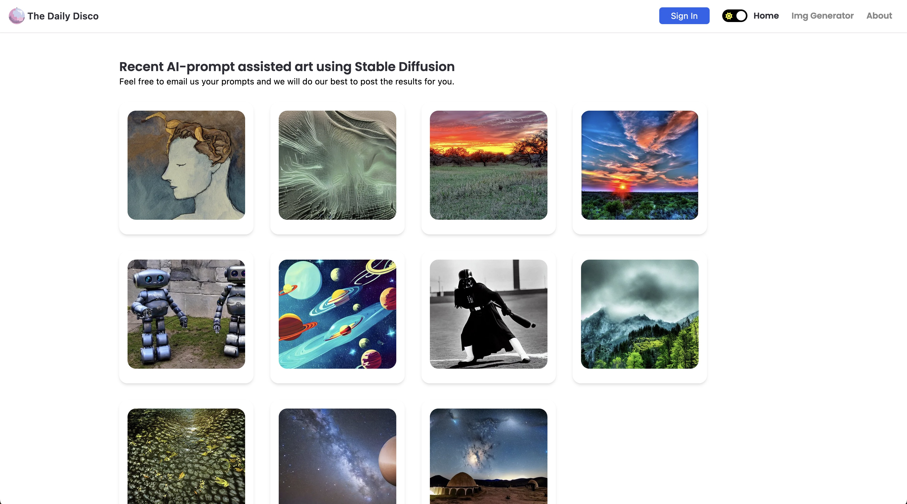

</img>

## What is this?

The-template is a high amount of my developer skills wrapped up in one application: a social media site where you can create AI generated prompts and share the pictures socially. I will also be hosting special tutorials to how to create many AI applications.

## Login

For now you can login in with Google, I plan to add others, such as GitHub, in the future.

## Future Plans

I want to create an area for short story or poem writers to share stories based off their AI generated picture, read a great story and having it shared with an image is great.

## Tools used

Next JS: https://nextjs.org/

Replicate inpainter: https://github.com/replicate/inpainter

Tailwind CSS: https://tailwindcss.com/

Hygraph: https://hygraph.com/

## Getting Started

Set your environment variables and make sure you restart your terminal.

Do "npm install"
Run "npm run dev"

The browser should now open on localhost.
